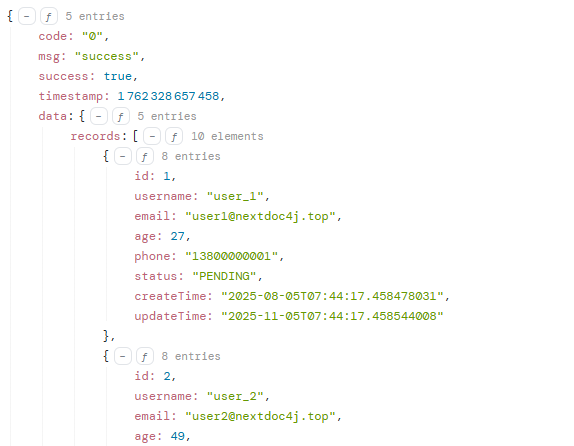
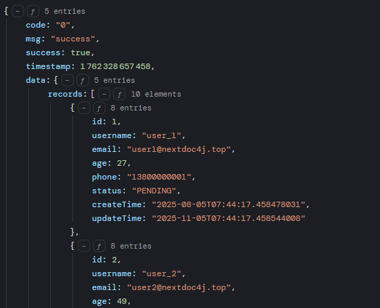

# Vue 3 Json Viewer

This component does not use any external dependencies and implemented using Vue 3 and TypeScript.

> [!IMPORTANT]
> This project is a work in progress.

## Features

- 🎨 **Theme Customization** - Supports custom color themes
- 🌓 **Dark Mode** - Built-in light & dark themes
- 📦 **Lightweight** - No external dependencies
- 🔍 **Expand/Collapse** - Supports node expansion and collapsing
- 📋 **Copy Function** - Supports copying JSON to clipboard
- 💪 **TypeScript** - Full type support
- 🎯 **Tree-shaking** - Supports on-demand import

## Installation(WIP)

> [!IMPORTANT]  
> This component is currently under development. You can clone this repository using Git, then run `pnpm install` to install dependencies and `pnpm dev` to launch the playground environment.

```bash
# npm
npm install @ppxb/vue3-json-viewer

# pnpm
pnpm add @ppxb/vue3-json-viewer

# yarn
yarn add @ppxb/vue3-json-viewer

```

## Screenshots





## License

[MIT](./LICENSE) License © [ppxb](https://github.com/ppxb)
